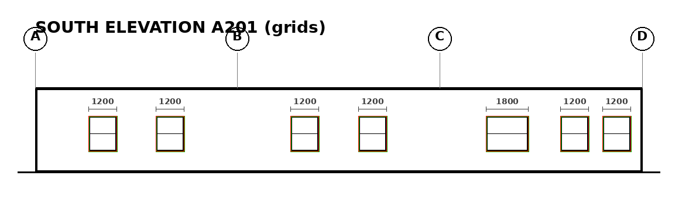
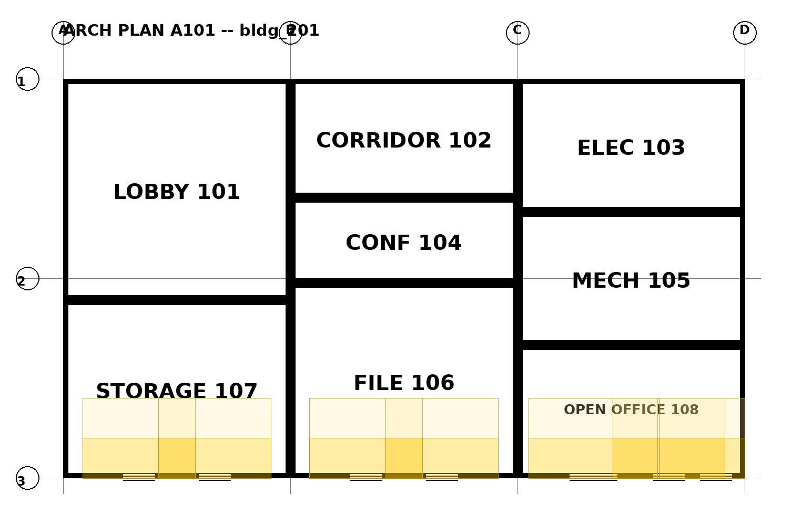

# Exact Window Positioning from Elevations

## Why

Count × schedule gives window *areas* — enough for load calcs. Two
things need exact window *placement* on walls:

1. **Visual verification** that the BEM matches the elevations (a human
   can see the model looks like the drawing, not just that areas agree).
2. **Daylight-responsive lighting controls**: ASHRAE 90.1 sidelighted
   zones derive from window head height and the host wall. Without
   per-window position + head height, daylighting can't be modeled.

## Pipeline (`elevation_windows.py`)

```
elevation raster (sheet px)
  -> detect_windows()            # instance rectangles: u0,u1,v_head,v_sill
  -> register (grid | geometric) # -> FacadeWindow in facade meters
  -> merge_elevation_observations()  # dedup across elevations
  -> attach_merged_windows()     # -> Space openings with EXACT placement
  -> reconcile_window_counts()   # elevation instances vs arch-plan tags
  -> compute_daylit_zones()      # primary/secondary sidelighted polygons
```

### Detection

`ContourWindowDetector` (classical CV for clean digital drawings):

- Thresholds ink, runs `findContours` with **RETR_TREE**. This matters:
  windows are drawn *inside* the wall outline's hollow interior, so
  their contour's parent is the wall's inner edge — `RETR_EXTERNAL`
  silently suppresses every window. (This was found the hard way during
  validation: 0/7 detected until the hierarchy was handled.)
- Accepts only **even hierarchy depth** (ink objects); odd depth = hole
  boundaries (wall inner edge, glyph counters).
- Shape filters: 4-vertex convex polygon, area 0.4–12 m², aspect ratio
  0.3–4.0, fill ratio ≥ 0.85.
- Rejects: wall outlines (hollow), grid bubbles (ellipses), title and
  dimension text (size/shape), dimension lines (extreme aspect),
  mid-window mullion lines (merged into the window component).

New backends plug in via `register_backend(name, backend)` — a YOLO
detector replaces the contour stage without touching anything
downstream. The detector only outputs sheet-px rectangles.


*Green = detected, red = ground truth. Dimension lines ("1200") and
grid bubbles are correctly ignored.*

### Registration mapping

Each observation maps through `registration.FacadeRegistration` to
`(s0, s1)` along the facade (meters from the reference corner),
`s_center`, `sill_m`, `head_m`. Both paths supported:

- **Grid bubbles** → confidence 0.95.
- **Geometric facade-corner fallback** → confidence 0.65, review-flagged.

A `category_hint` is derived from the sill: `sill < 0.15 m` suggests a
door (v1 only places windows; doors on elevations are future work).

### Tag association

The detector finds *instances*, not tags (no OCR on elevations in v1).
`assign_window_tag()` matches measured (width, height) to the nearest
window-schedule entry within 0.15 m. Unmatched instances keep measured
dims and are flagged for review — never dropped. If schedule dims win,
the measured dims stay in the provenance note as a cross-check.

### Dedup across elevations (answers `docs/building_model.md` Q3)

Two elevations of one facade are an **asset**, not a problem:
`merge_elevation_observations()` merges by along-wall interval overlap
(≥ 50% of the narrower) plus center agreement (≤ 0.30 m tolerance).
Merged position/sill/head are confidence-weighted means; every source
observation is recorded.

- **Conflict** (overlap but centers disagree beyond tolerance): both
  kept separate, flagged `elevation_conflict` for review — never
  silently averaged.
- **Single-source** windows (seen on only one elevation): kept, noted.

Merging happens in *meters*, so elevations drawn at different scales
(40 vs 34 px/m in the synthetic set) merge correctly.

### Reconciliation

`reconcile_window_counts()` compares per-tag counts: arch-plan window
tags (per facade) vs merged elevation instances.

- More elevation instances than plan tags → "instance(s) with no
  matching arch-plan tag".
- More plan tags than instances → "tag(s) with no elevation instance".
- Untagged instances reported as `UNTAGGED`.

Every mismatch becomes a `window_reconciliation` review item. A clean
run produces zero flags.

### Daylighting

`compute_daylit_zones()` per space, per ASHRAE 90.1-2019 §3.2
sidelighted-area geometry (parameterized in `DaylightParams`):

| Zone | Depth from window wall | Lateral extent |
|---|---|---|
| Primary | 1.0 × head height | window width + 1.0 × H each side |
| Secondary | 1.0–2.0 × head height | same |

Both clipped to the room polygon (Sutherland–Hodgman; rooms assumed
convex — true for the synth, check before real plans) so zones never
leak into neighboring rooms. Results attach to `Space.daylight` as
`DaylitZone` records with provenance (source sheets, window id, H).


*Primary (darker) and secondary sidelighted zones extend from the south
wall into the correct rooms.*

### Assumptions and version notes

- Head height H = `head_m − sill_m` from the elevation (not the schedule).
- Lateral/depth extents clip at the room polygon, **not** at interior
  partitions: 90.1 truncates sidelighted areas at full-height (≥ 60 in.)
  partitions, which are not modeled in v1 — zones in partitioned rooms
  may be optimistic.
- Toplighting (skylights) out of scope.
- 90.1-2016/2019/2022 agree on the sidelighted-area *geometry*; control
  *requirements* differ by version — only geometry is implemented.

## Validation (`run_elevation_windows.py`)

Needs cv2: `~/workspace/.venv-ocr/bin/python run_elevation_windows.py`.
3 buildings × 2 elevations (40 vs 34 px/m; one with grid bubbles, one
without; multiple windows per room; near-corner windows):

| Check | Result |
|---|---|
| Detection recall | 18/18 (7+5+6), 0 false positives |
| Along-wall center error | mean ~0.5 cm, max 1.2 cm |
| Width / sill / head error | ≤ 3.4 cm |
| Schedule-tag association | 18/18 correct |
| Dedup (2 elevations → 1 window each) | exact, 0 conflicts |
| Window → room attach | 18/18 vs GT |
| Reconciliation (clean run) | 0 flags |
| Reconciliation (injected ±) | all 3 mismatch classes flagged |
| Dedup conflict (injected 0.5 m disagreement) | flagged, not merged |
| Daylit zones inside room, depths = min(f·H, room depth) | 0 violations |
| JSON round-trip (new fields) | pass |

`run_multidiscipline.py` (pre-existing suite) still passes unchanged.

## Schema changes (`building_model.py`)

- `SpaceOpening` gains `head_m` and `s_center_m` (exact placement
  alongside the existing `host_interval_m` / `sill_m`).
- New `DaylitZone` / `SpaceDaylight`; `Space.daylight` field. JSON
  revival handles them generically.

## `link.py` changes

- `_south_wall_segments` → public `south_wall_segments` (kept alias).
- `build_model(..., elevation_key=None)` skips elevation linking;
  `elevation_windows.build_model_with_elevations()` uses this, then
  runs the multi-elevation pipeline.

## Limitations / open questions

1. **South facade only** (inherits the v1 scope); other facades need
   wall segments + `_facade_frame` entries — the math is already
   facade-generic.
2. **No door detection on elevations** (hint only); curtain walls /
   ribbon windows (one wide glazed band) will detect as a single
   instance — acceptable for area + daylighting, wrong for counts.
3. **Convex-room assumption** in the polygon clip.
4. **Interior partitions** not modeled → daylit zones may extend past
   full-height partitions (optimistic).
5. Nominal confidences (0.9 detection, 0.95/0.65 registration) are
   uncalibrated engineering judgments — same caveat as the rest of the
   model.
6. Real-elevation robustness (scanned noise, leaders, overlapping
   annotation) untested; the backend registry exists precisely so a
   learned detector can take over.
